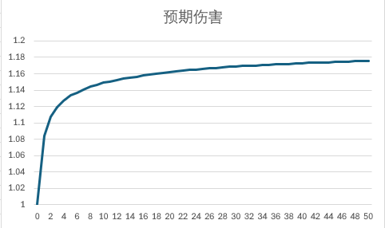

# 碧轨数值设计推导及反拆

## 体验

序章（2h）：高压的战斗环境，需要持续给主C上buff并给自己吃药保证存活。

第一章（11h）：S技、物理输出/buff为主导的战斗环境，强调通过S技的倍率打出有效输出

第二章（12h）：基本同第一章，但出现一些AOE法术辅助进行输出

间章：海滩（4h）：强调单体作战能力，生存/输出复合检测。间章和第二章中有一些战斗场景仅仅允许2名或更少角色上场。

第三章（8+6h）：要求利用高阶单体法术进行高效输出，强调上速度等debuff。（没有利用加速模式，且未进行刷取，在战鬼战中无法达成dps check，额外耗费了时间）

第四章（8h）：利用高阶群体法术清野怪，闪避放风筝打boss，缇欧S技无敌抗AOE。

断章：越狱（2h）：强调单体作战能力，灵活利用主角战技吃条上buff。

终章（18h）：同第四章，但boss和怪的抗性导致必须使用buff而不是debuff来进行辅助，增加了玩家的蓝量压力。同时需要活用核心回路升到5级解锁的高强度专注魔法。

## 问题拆解

若需要为碧轨设计数值，我们需要从**经济数值**和**战斗数值**两方面进行问题拆解。其中，经济数值将会决定玩家打怪掉落、任务奖励数值、宝箱内容等与游戏内货币相关的数值；战斗数值将会决定玩家战斗时的攻击/防御、升级经验值需求、道具回复量等与战斗相关的数值。

## 经济数值

### 确认反馈逻辑以及游戏内经济系统类型

游戏内的反馈逻辑为：素材获取 - 养成提升 - 战斗验证。在这类单机游戏中，玩家的资源入口为固定任务奖励发放和可重复刷取的打怪掉落。玩家的资源出口为有上限的战力提升和收藏品收集。所以我们需要实现的目标是**入口与出口平衡**，并控制玩家在游戏过程中的刷取时间以平衡玩家游戏行为占比。

### 正向推导

我们假设采用基于玩家游玩时间的设计，\(产出价值 = 等级 \times 游玩时间 \times 模块倍率\)。并确定玩家在不同模块内的游玩时间。更重要的模块，例如主线任务，会拥有更高的模块倍率，从而使得玩家完成主线任务的意愿更高。玩家若需要在10级花费10分钟完成主线任务(模块倍率2.0)，那么该主线任务的总奖励应为200单位价值（包括主线遇敌的掉落价值、任务奖励价值）。

将这些模块的产出价值加总便可得到玩家在一段游玩时间内的总产出价值。玩家会需要将这些价值投入到资源出口处。根据不同出口所占比例，我们可以估计出每个模块对于玩家资源的消耗。接下来，我们根据不同出口的类型进行价值计算：
1. 永久，不可重复刷取（例：武器装备）：若玩家提升武器模块的方式只有购买武器这一项，那么我们可以通过[单机RPG武器定价](#weapon-pricing)的方式来计算武器的价值。
2. 永久，可重复刷取（例：圣遗物、词条）：我们可以通过计算玩家时间投入的方式来计算一次随机的价值。见[单机RPG词条定价](#relic-pricing)。
3. 消耗品，不可重复获取（例：成就类收藏品）：我们可以根据预期目标达成时间来计算这些道具的价值。
4. 消耗品，可重复获取（例：战斗道具）：我们需要道具对于玩家行为的影响来估计这些道具的价值，见[单机RPG战斗道具定价](#item-pricing)

### 反向推导 

接下来，我们将简要分析碧轨一部分具体模块的数值与其之间的关系，并与前文的正向推导进行对比。

- 经验值系统
- 金币系统
- 战力成长

#### 经验值系统

#### 金币系统

#### 战力成长

## 附带计算

### 单机RPG武器定价<a id='weapon-pricing'></a>

#### 假设前提
在游戏模块（具体章节）内，
- 玩家在满练度时的战力为原练度时的200%
- 共有4个战力提升模块，每个模块对于战力的提升相互独立且为乘算
- 玩家需要达到至少原练度的150%才能通过该模块。达到该战力的时间为30min
- 玩家预期的战力提升时间为60min，满练度为120min
- 玩家在主线中花费的时间为120min，为固定时间
- 玩家在原练度时等级为50，满练度时等级为60

#### 武器设定提升计算
- 每个战力模块在满练度时的提升为2^{1/4}=18.92%，花费时间为30min
- 每个战力模块在保底练度时的提升为1.5^{1/4}=10.67%，花费时间为7.5min
- 我们希望随着玩家花费时间增加，提升逐渐减少，故函数形如f(t) = p_1 * 2^(p_2 * t) + p_3, 已知f(0) = 1, f(7.5) = 1.1067, f(30) = 1.1892，近似计算后得 f(t) = -0.1982 * 2^(-0.1487 * t) + 1.1982
```matlab
    % 1. Define the data points
    t_data = [0; 7.5; 30];
    f_data = [1; 1.1067; 1.1892];

    % 2. Define the model function f(t) = k*2^(a*t) + b
    % The parameter vector 'p' holds the coefficients: p(1)=k, p(2)=a, p(3)=b
    model = @(p, t) p(1) * 2.^(p(2) * t) + p(3);

    % 3. Provide an initial guess for the parameters [k, a, b]
    % From f(0)=1, we know k+b=1. If we guess k=1, then b=0.
    % A small positive 'a' is a reasonable start.
    p0 = [-0.165030382039, -0.2, 1.1892];

    % 4. Call lsqcurvefit to find the best-fit parameters
    % Syntax: lsqcurvefit(function, initial_guess, x_data, y_data)
    p_fit = lsqcurvefit(model, p0, t_data, f_data);

    % 5. Display the results
    k = p_fit(1);
    a = p_fit(2);
    b = p_fit(3);

    fprintf('The solved parameters are:\n');
    fprintf('k = %f\n', k);
    fprintf('a = %f\n', a);
    fprintf('b = %f\n', b);

    fprintf('\nThe final equation is: f(t) = %.4f * 2^(%.4f * t) + %.4f\n', k, a, b);
```
- 根据以上近似，我们可以得到玩家花费不同时间可得到的预期提升。且我们可以得到玩家的预期战力为f(15)^4 = 175.27%
- 我们可以根据玩家在单个战力模块的时间投入回报节点来安排其对应收益。（例如，在5分钟时获取饰品A1，在10分钟时获取饰品A2；若A1与A2相互冲突，A1的提升应为7.98%，A2的提升应为12.75%）

#### 武器价值计算
- 以武器获取为例。若安排3档武器，1级为自带，2级为合格，3级为最强。那么1级武器的伤害结果为100%，2级为110.67%，3级为118.92%。2级需要7.5分钟获取，3级需要30分钟获取。
- 玩家在游戏过程中不断产生价值，其价值与游玩时间、游戏等级成正比。我们可以令每分钟产生对应等级的价值。其中，主线产生的价值翻倍以引导玩家行为。
- 玩家会将游戏过程中产生的价值以货币的形式投入于战力模块，从而提升自己的战力。
- 玩家在游戏模块中最高的花费时间为240min。其中，120min为主线，产出\(120 \times 50 \times 2=12000\)单位价值，120分钟为养成，产出\(120 \times 50=6000\)单位价值，共18000单位价值。这些价值的出口在于战力模块，也就是说每个战力模块可以被分配4500单位价值。
- 我们希望玩家无需重复刷取，可以通过3级武器=2级武器+升级包的形式设计武器购买。根据获取时间比例，2级武器为900单位价值，3级武器升级包为3600单位价值。若我们平滑武器强度曲线，令3级武器为19%提升，但令2级武器为14%提升，则可以通过前文中计算的公式来获取刷取时间：2级12分钟。那么此时2级武器为1800单位价值，3级武器升级包为2700单位价值，玩家的观感更好。

### 单机RPG圣遗物定价<a id='relic-pricing'></a>

#### 假设前提
在该模块内，
- 玩家的原始状态如下：
    - 攻击力 = 100
    - 防御力 = 100
    - 暴击率 = 50%
    - 暴击伤害 = 200%
    - 速度 = 1
- 共有以下几种词条：
    - 攻击力 + 7%
    - 防御力 + 5%
    - 暴击率 + 10%
    - 暴击伤害 + 20%
    - 速度增加 + 4%
    - 无效果 * 4
- \(玩家战力 = (预期伤害 + 防御力) * 速度\)
- 玩家购买该圣遗物时，随机生成4条词条，每条词条的选取相互独立，多个百分比结果为加算。
- 玩家预期的花费时间为60min，预期提升为15%
- 玩家等级为50

#### 最优结果计算
- 对于每种词条，我们设词条数为n_i，易得
$$
D(\vec{n}) = ((100 + 7n_1) \times ((0.5 - 0.1n_3) + (0.5 + 0.1n_3) * (2 + 0.2n_4)) + (100 + 0.05n_2)) \times (1 + 0.04n_5) \\
\sum n_i = 4, 0 \leq n_i \leq 4, n_i \in \mathbb{Z}
$$
```matlab
% --- 1. Define the Objective Function ---
% We want to MAXIMIZE D, so we will MINIMIZE -D.
objectiveFun = @(n) -(((100 + 7*n(1)) * ((0.5 - 0.1*n(3)) + (0.5 + 0.1*n(3)) * (2 + 0.2*n(4))) + (100 + 0.05*n(2))) * (1 + 0.04*n(5)));

% --- 2. Define Constraints ---
% Number of variables
nvars = 5;

% Bounds (0 <= n_i <= 4)
lb = zeros(1, nvars); % Lower bound of 0 for all variables
ub = 4 * ones(1, nvars); % Upper bound of 4 for all variables

% Linear Equality Constraint (sum(n_i) = 4)
Aeq = ones(1, nvars); % [1, 1, 1, 1, 1]
beq = 4;

% Integer Variables (all 5 variables are integers)
intcon = 1:nvars; % [1, 2, 3, 4, 5]

% --- 3. Run the Genetic Algorithm Solver ---
% For reproducibility of the result
rng default 

options = optimoptions('ga', 'Display', 'iter');
[n_optimal, fval] = ga(objectiveFun, nvars, [], [], Aeq, beq, lb, ub, [], intcon, options);


% --- 4. Display the Results ---
% The maximum value is -fval because we minimized the negative of the function.
max_D = -fval;

fprintf('Solver finished.\n');
fprintf('Optimal solution vector n:\n');
disp(n_optimal);
fprintf('Maximum function value D(n): %f\n', max_D);
```
- 求得最优解为2条暴击2条暴击伤害，此时战力为原战力的119.2%

#### 提升曲线计算：抽取次数 vs 期望伤害

~~因为之前使用python模拟过了，这次用vba模拟试试~~

```vba
Sub GetExpectedDamage()
    Dim MaximumDamage As Double
    Dim ExpectedDamage As Double
    Dim NumberOfExperiments As Long
    Dim SimRelicRoll As Double
    Dim n1 As Integer
    Dim n2 As Integer
    Dim n3 As Integer
    Dim n4 As Integer
    Dim n5 As Integer
    Dim RngRes As Integer
    NumberOfExperiments = 100000
    For i = 1 To 50
        ExpectedDamage = 0
        For n = 1 To NumberOfExperiments
            MaximumDamage = 25000
            For j = 1 To i
                n1 = 0
                n2 = 0
                n3 = 0
                n4 = 0
                n5 = 0
                For k = 1 To 4
                    RngRes = Int((9 * Rnd) + 1)
                    If RngRes = 1 Then
                        n1 = n1 + 1
                    ElseIf RngRes = 2 Then
                        n2 = n2 + 1
                    ElseIf RngRes = 3 Then
                        n3 = n3 + 1
                    ElseIf RngRes = 4 Then
                        n4 = n4 + 1
                    ElseIf RngRes = 5 Then
                        n5 = n5 + 1
                    End If
                Next k
                SimRelicRoll = ((100 + 7 * n1) * ((0.5 - 0.1 * n3) + (0.5 + 0.1 * n3) * (2 + 0.2 * n4)) + (100 + 5 * n2)) * (100 + 4 * n5)
                MaximumDamage = IIf(SimRelicRoll > MaximumDamage, SimRelicRoll, MaximumDamage)
            Next j
            ExpectedDamage = ExpectedDamage + (MaximumDamage / NumberOfExperiments)
        Next n
        Worksheets(4).Range("C" & i + 2).Value = ExpectedDamage
    Next i
End Sub
```



我们希望满足关键节点的投入资源符合预期。由模拟可得到玩家到达预期提升15%的期望抽取次数：11次。由于玩家预期花费时间为60min，预期花费总价值为60*50 = 3000单位价值。故每次抽取的价值约为273单位价值。

### 单机RPG战斗道具定价<a id='item-pricing'></a>

这里我们主要讨论对于战斗有影响的道具。我们可以根据道具的作用将其进行分类：
1. 增加战斗资源（在探索过程中，减少回城回复的时间消耗）：HP回复、MP回复、buff药等
2. 解决特殊战力需求（使玩家能击败原本无法击败的敌人）：解除石化、复活药等

战斗的本质是进行资源的转换，玩家将HP、MP、CP等资源转换成伤害，从而击败敌人。所以我们可以将道具的价值与武器的价值通过对于资源转换效率的影响这一锚点链接起来。由于我们已知武器的价格以及其效果，故可以推得其对于资源转换效率的影响。之后，我们可以通过比较武器与道具对于资源转换效率的影响的异同推导道具的价格。

#### 价格试推导

根据[单机RPG武器定价](#weapon-pricing)中的假设及其对于武器的定价计算，我们有：2级武器为1800单位价值，提升14%

我们接着假设玩家在流程中预期面临5场战斗，对于一场通常的战斗，我们有：
1. 该战斗持续10单位时间(t)
2. 怪的血量为10000，输出为100/t
3. 玩家的血量为2000，输出为1000/t

那么对于2级武器，玩家的输出会提升至1400/t，战斗持续时间会降低至7.14t，玩家承受的伤害会减少286.

**道具1**：花费1单位时间使用，使得接下来3回合的输出提升50%

若我们在该场战斗中使用该道具，战斗持续时间会降低至9.5t，玩家承受的伤害会减少50（在实际开发过程中，还需要考虑玩家的输出曲线、输出爆发等因素）。根据承伤减少的比例，若该道具不会被消耗，那么该道具的售价应为1800/286*50≈315单位价值；若该道具可被消耗，那么其价值应根据战斗场数减少，为315/5=63单位价值。

**道具2**：花费1单位时间使用，恢复500血量

若我们在该场战斗中使用该道具，战斗持续时间会提升至11t，玩家承受的伤害会减少400。同样，根据承伤减少的比例，该道具的售价应为2516或503，取决于是否会被消耗。

尽管这一价格看起来偏高，但考虑到我们的战斗模型假设，该价格是合理的。因为它极大地降低了玩家的战损。若我们将怪的输出调整为更高的150，那么该道具的售价便会降低为1800/429*350/5=294单位价值。

**道具3**：花费1单位时间使用，解除石化（持续3回合，无法行动）。

这里我们同样可以使用战损逻辑来计算该道具的价值。对于敌人会使用1次石化的战斗，若我们在战斗中使用该道具，战斗持续时间会从13t降低至11t，玩家承受的伤害会由1300降低至1100。对于武器的提升依旧为286。我们可以得到该道具的售价为1258/252，取决于是否会被消耗。

**道具4**：花费1单位时间使用，复活角色，为其恢复1000血量。

复活药在战斗中起到了恢复和提升上限的作用。若我们忽视其提升上限的作用，我们可以通过其为角色恢复血量的功能估计其价值。而对于其提升上限的功能，我们可以通过估计最小投入来估计该道具的实际价值。假设其他条件相同，玩家的血量为900。我们可以使用复活药顺利通过；可以使用更强的武器顺利通过；也可以使用回复药顺利通过。这时，这些方式对于玩家的价值是相同的，都解决了实际的问题。那么复活药的价值应该不低于其他方式的最少价值。额外的，从玩家游戏体验的角度考虑，复活药的价格应稍高于其他方式的价值。通过提升上限角度与恢复血量角度计算出的价值两者中的高者即为复活药的最终价值。

**缺陷与不足**：该模型忽略了道具直接的互相影响，且假设了玩家的输出为线性。在实际的游戏设计中，我们需要考虑玩家具体的战斗行为，并根据实际数据来调整定价。


